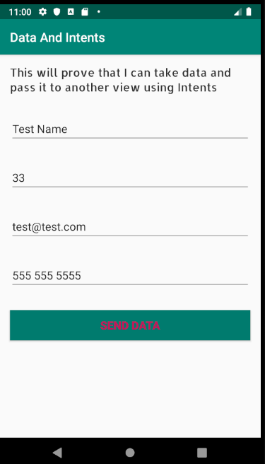
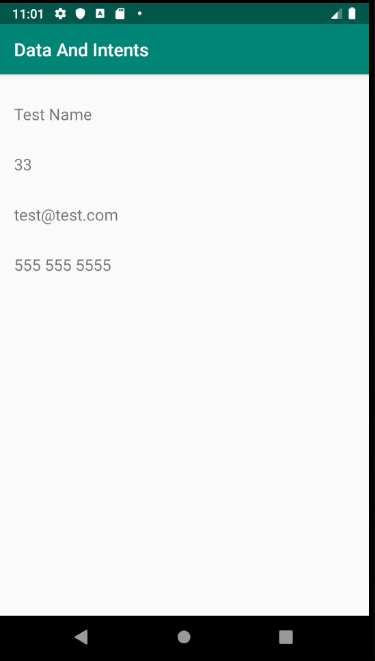

# Data And Intents
this app shows how to use intents to send data from one screen to the next.
In this app the user fills in their name age email and phone numbers.  
If all fields are not filled in it will not let you continue and will display
a toast message saying please fill in all data fields.

Once all data is filled in it is sent to the data receiver activity and displayed.

## App Screenshots

* MainActivity Screenshot \n
 \n

* DataReceiverActivity Screenshot \n
\n